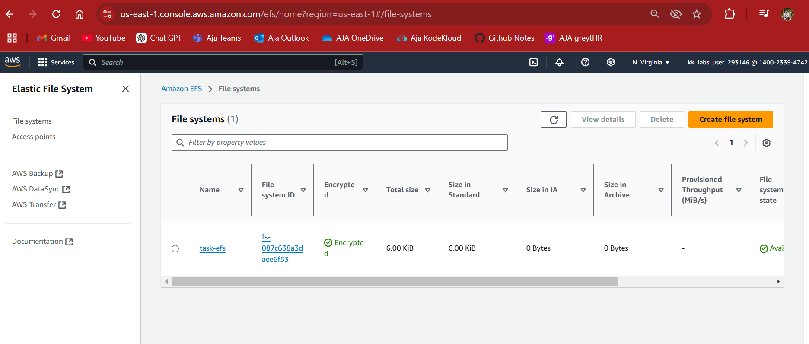
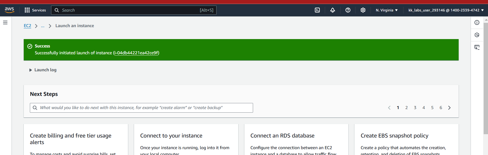
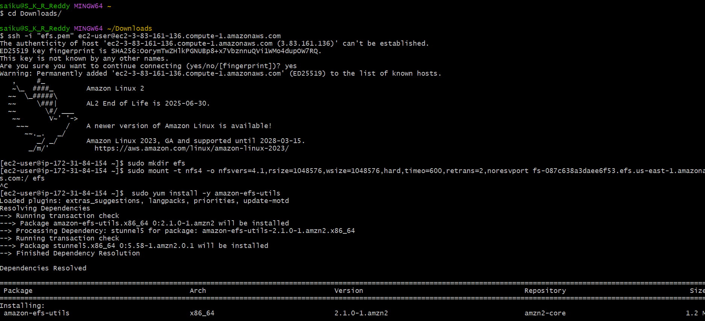
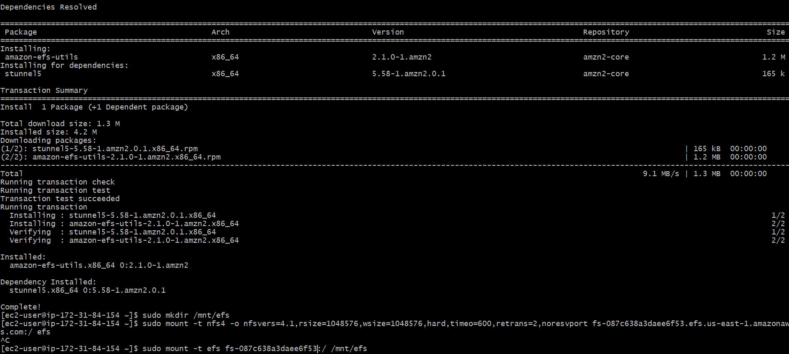
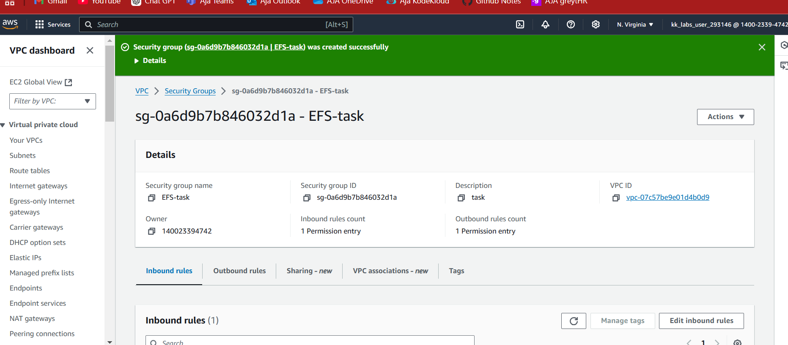
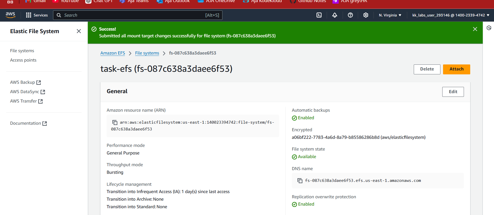
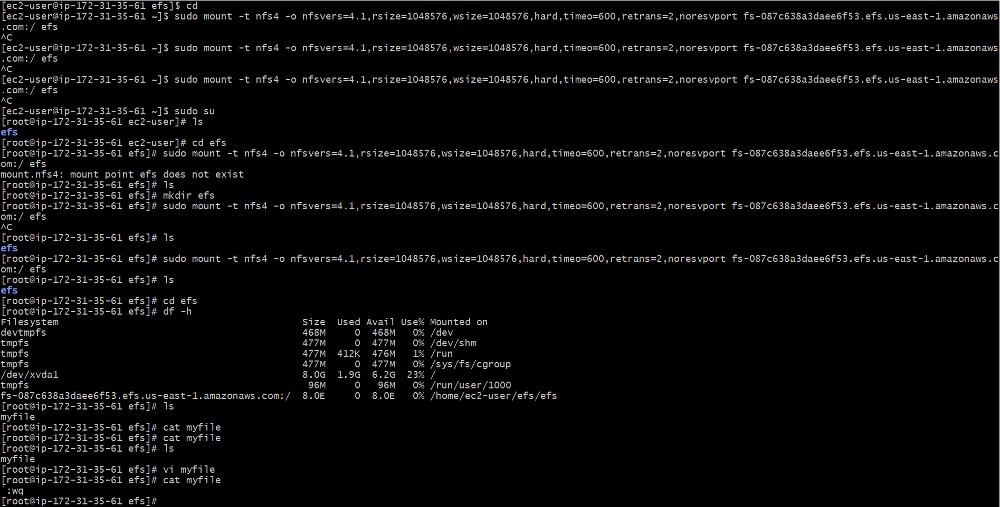
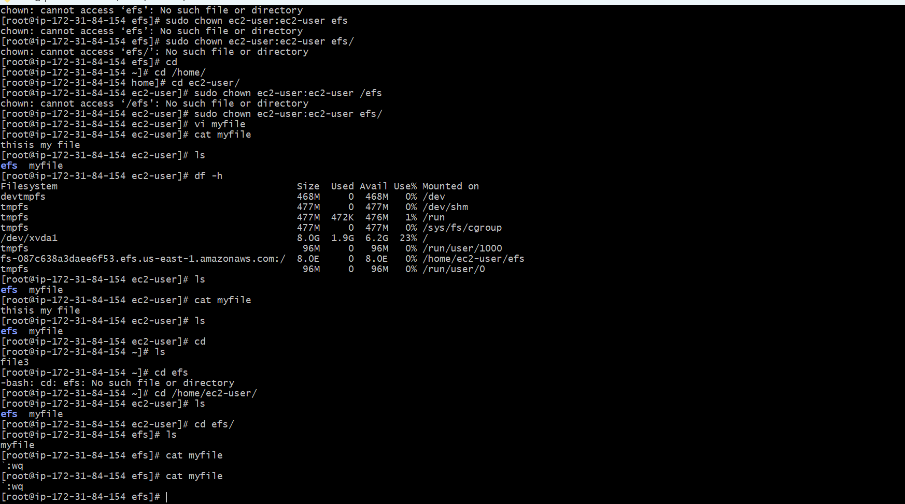
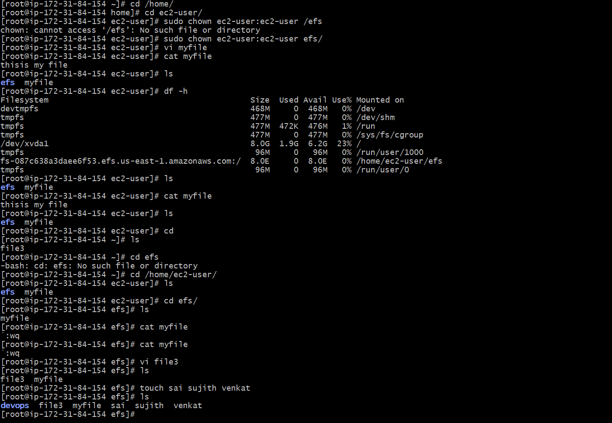
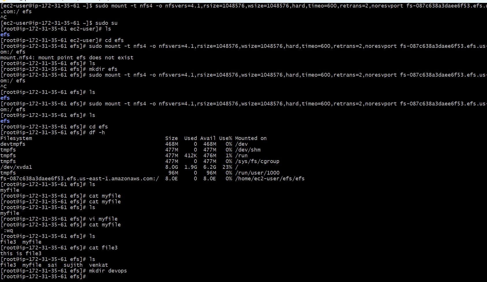

Creating a real-time application using AWS EC2 with an Elastic File System (EFS) volume allows multiple instances to share a common file system,
making it ideal for scenarios like real-time data processing, content management, or collaborative applications. 
Below, I’ll guide you through setting up a simple real-time chat application that utilizes EFS for storing chat messages.

Project Overview: Real-Time Chat Application Using AWS EC2 with EFS

Prerequisites
- An AWS account
- AWS CLI installed and configured
- Basic knowledge of Node.js and Express

Step-by-Step Guide

Step 1: Create an EFS File System

1. **Log in to the AWS Management Console** and navigate to the **EFS** service.

2. **Create a New File System:**
   - Click on "Create file system."
   - Choose the default settings, and make sure to create the file system in the same VPC where your EC2 instances will reside.
   - Note the **File System ID** for later use.
   - Click "Create file system."

3. **Configure Access Points (optional):** You can set access points for permissions and paths, but for simplicity, we’ll use the default settings.

Step 2: Create and Launch EC2 Instances

1. **Navigate to the EC2 Dashboard** in the AWS Management Console.

2. **Launch EC2 Instances:**
   - Click on "Launch Instance."
   - Choose an Amazon Machine Image (AMI), such as **Amazon Linux 2**.
   - Select an instance type (e.g., `t2.micro` for the free tier).
   - Configure instance details, ensuring they are in the same VPC as your EFS.
   - **Add Storage:** Leave the default settings.
   - **Configure Security Group:**
     - Allow inbound traffic on port `22` (SSH) and port `3000` (for the chat application).
   - Review and launch the instance.

3. **Note the public DNS or IP address** of the instance for accessing the application later.

Step 3: Mount EFS on the EC2 Instances

1. **SSH into Your EC2 Instance:**
   ```bash
   ssh -i your-key.pem ec2-user@your-instance-public-dns
   ```

2. **Install the EFS Utilities:**
   ```bash
   sudo yum install -y amazon-efs-utils
   ```

3. **Create a Mount Point:**
   ```bash
   sudo mkdir /mnt/efs
   ```

4. **Mount the EFS File System:**
   - Replace `fs-XXXXXX` with your EFS File System ID.
   ```bash
   sudo mount -t efs fs-XXXXXX:/ /mnt/efs
   ```

5. **Ensure EFS is Mounted on Reboot:**
   - Edit the fstab file:
   ```bash
   echo "fs-XXXXXX:/ /mnt/efs efs defaults,_netdev 0 0" | sudo tee -a /etc/fstab
   ```
   

















Step 4: Cleanup

When you are done with your project, remember to terminate your EC2 instances and delete the EFS to avoid unnecessary charges.

### Conclusion

You have successfully created a real-time chat application using AWS EC2 with EFS for storage! 
This setup allows multiple EC2 instances to access shared data in real-time.