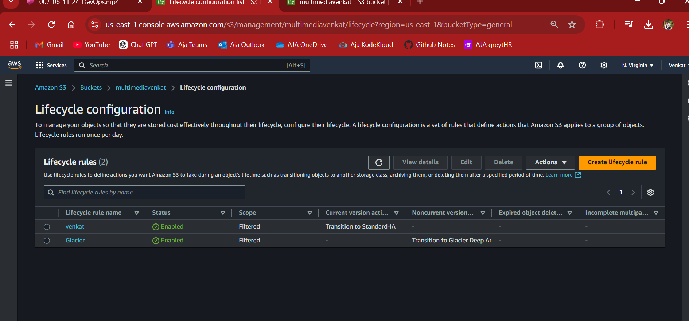
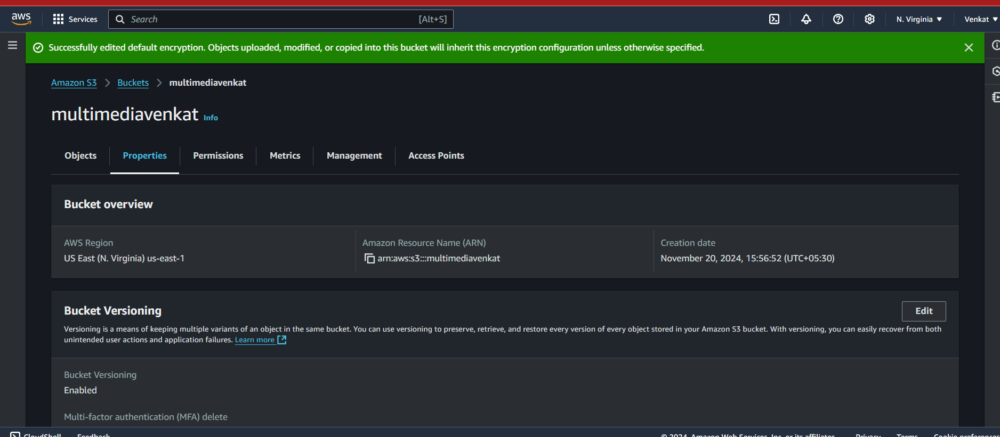
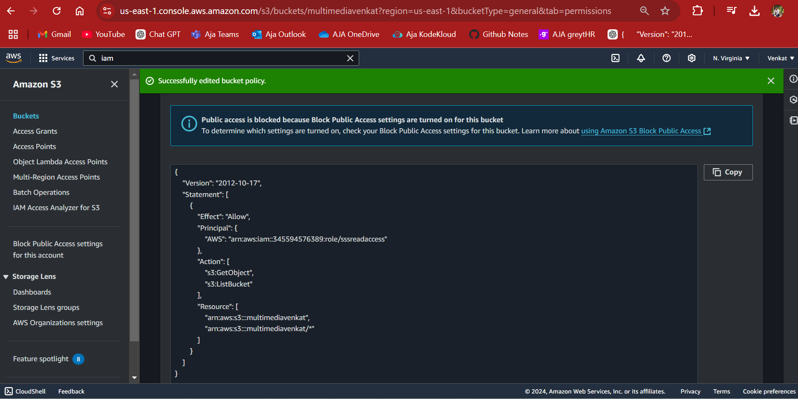
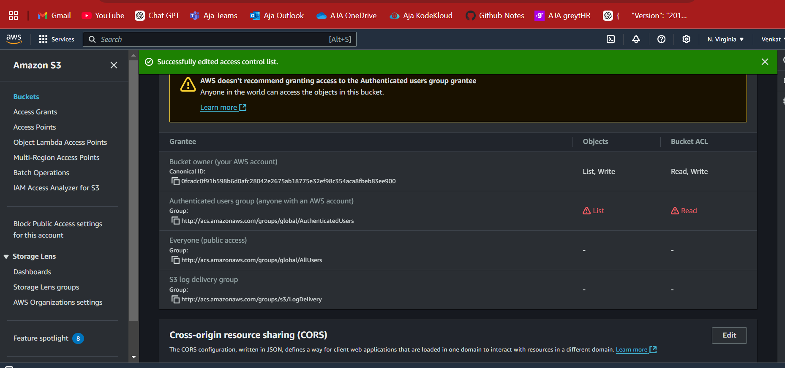
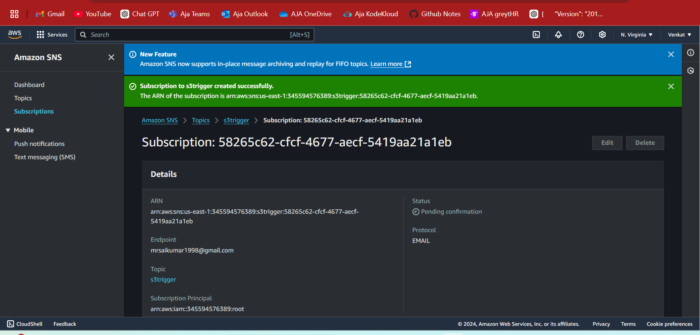
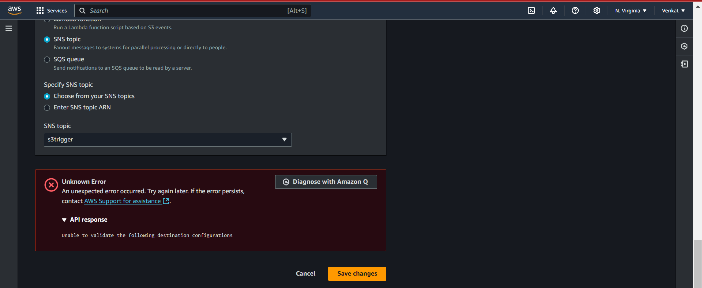

Task Overview

Participants will create an S3-based solution to store, organize, manage, and archive multimedia content (e.g., images, videos, documents). They’ll learn to set up bucket configurations, use object versioning, implement lifecycle policies, and enforce security through bucket policies and access controls.

Objectives

Gain practical experience with S3 bucket creation, object storage, versioning, and lifecycle policies.     
Learn to secure data using bucket policies, encryption, and access control lists (ACLs).       
Understand cost optimization through storage class transitions and lifecycle management    
Use S3 event notifications to simulate file management automation.

Step-by-Step Task Instructions

1.Create an S3 Bucket with Appropriate Naming and Versioning
Create a new S3 bucket named multimedia-storage-[yourname]-bucket.
Enable bucket versioning to manage file versions and track changes over time.
Upload a few files with the same name multiple times to test versioning. Observe how S3 maintains versions of each object.

2.Organize Files Using Prefixes (Folders)
Create a folder structure within the bucket. For instance:  
images/    
videos/    
documents/         
Upload several files into each "folder" and understand how prefixes work in S3 to simulate directory structures.

3.Implement Lifecycle Policies for Cost Optimization
Set up lifecycle policies for each folder to move objects to cost-effective storage classes over time: 

Move objects in the images/ folder to S3 Standard-IA (Infrequent Access) after 30 days.

Move objects in the videos/ folder to S3 Glacier after 60 days and delete them after 180 days.

Experiment with different configurations for archiving data based on folder and file type.

Document each lifecycle policy created and explain why it’s optimized for cost and access patterns.

4.Enable Server-Side Encryption     

Apply server-side encryption to the bucket to secure data at rest.

Use S3 managed keys (SSE-S3) or AWS KMS keys (SSE-KMS).

Document the steps taken to enable encryption and the differences between SSE-S3 and SSE-KMS.

5.Configure Access Controls and Bucket Policies, and
Create a bucket policy that grants read access to a specific IAM role or user.

Add an Access Control List (ACL) to give specific permissions to selected users or groups.

Ensure that public access is blocked (unless specified) to prevent unintended exposure.

Review the policy and understand how permissions are defined and restricted.

6.Set Up S3 Event Notifications for File Management Automation
oConfigure the bucket to send event notifications on specific events, such as s3:ObjectCreated:* or s3:ObjectRemoved:*.

Route notifications to an Amazon SNS topic or email to simulate automation for file management.

Upload and delete files in the bucket, observing notifications for each action.

7.Implement Cross-Region Replication (Optional)
Set up Cross-Region Replication (CRR) to duplicate data from your primary bucket to a secondary bucket in another AWS region.

Make sure versioning is enabled on both buckets and create IAM policies that permit replication.
oTest the replication by uploading files to the primary bucket and verifying their presence in the secondary bucket.
