CLI - Task

Install and Setup AWS Command Line Interface on Local machine

Configure Permissions and Access credentials 

- Create VPC using CLI

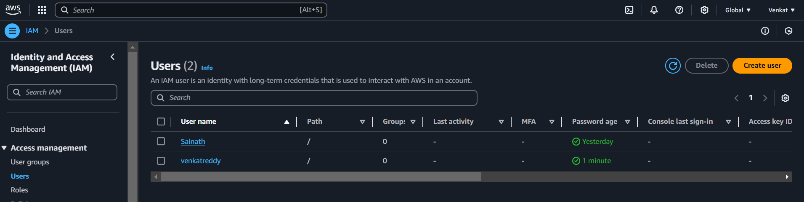

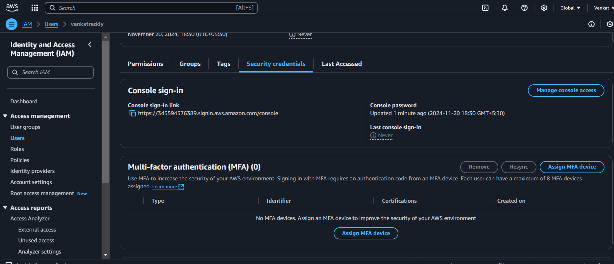

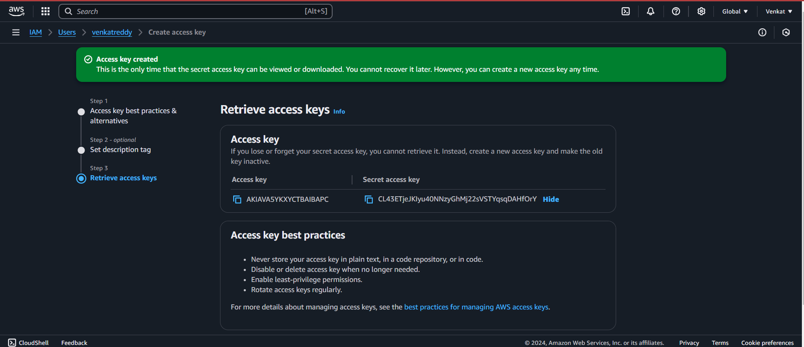

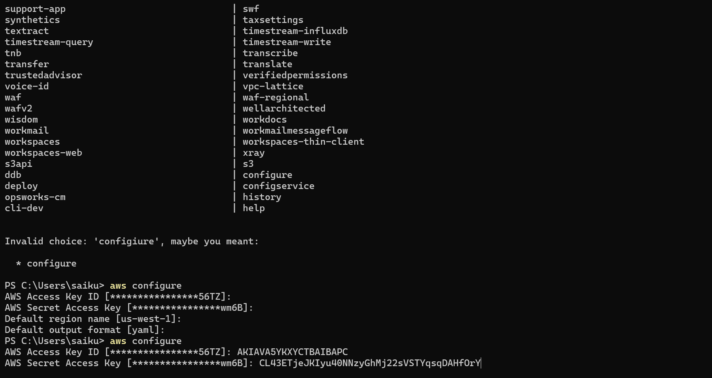

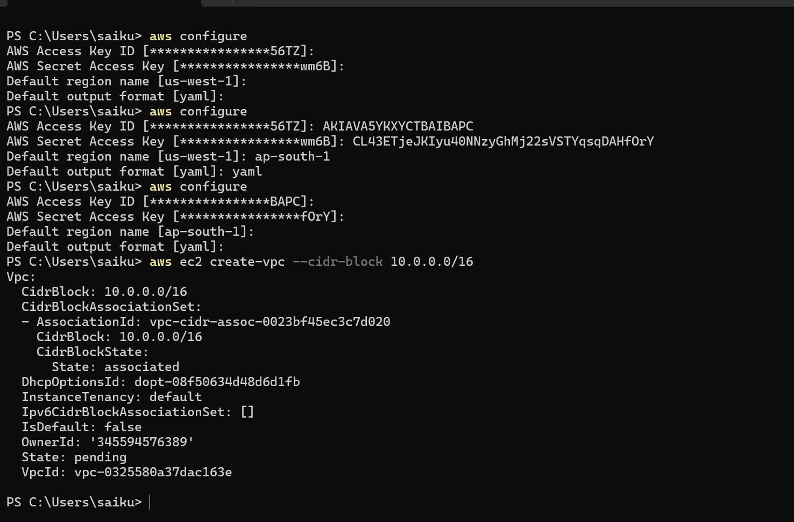

- create Pub and Pvt subnets

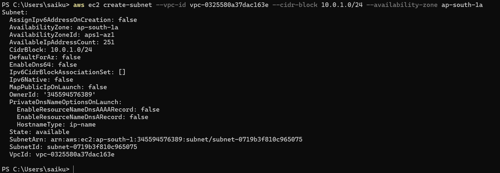

- create IGW

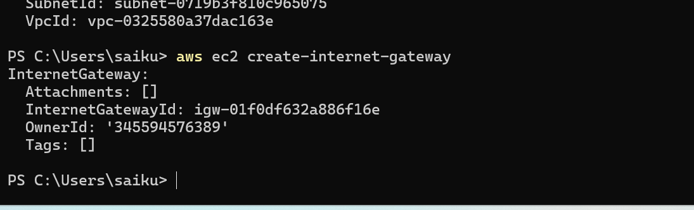

- Attach IGW to VPC

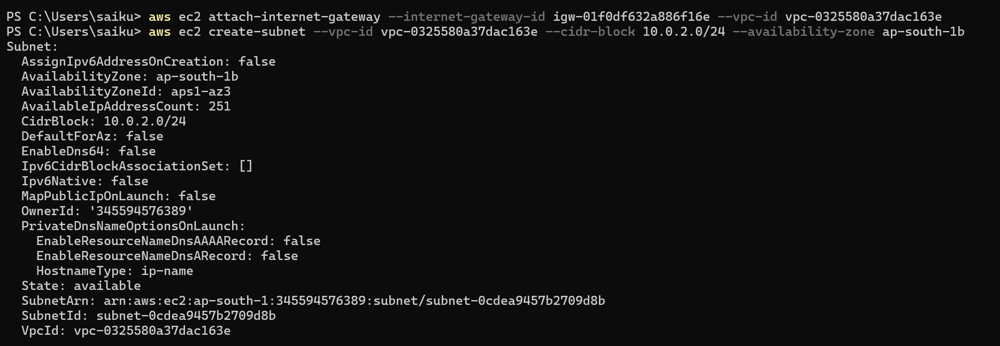

- Create Pub and PVT RT

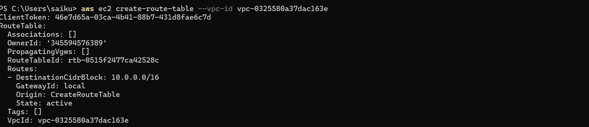

- Attach Pub sub to Pub rt

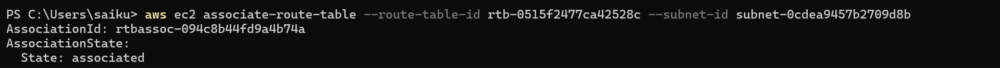

- Attach Pvt Sub to Pvt rt

- Attach IGW to Pub RT

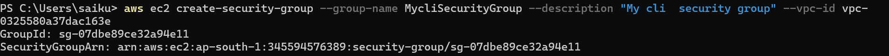

- Create Sg for ssh // http

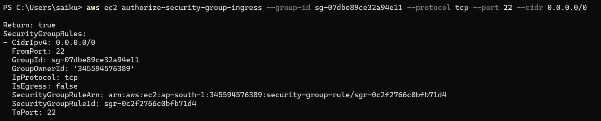

- Create a Ec2 in Pub Sub

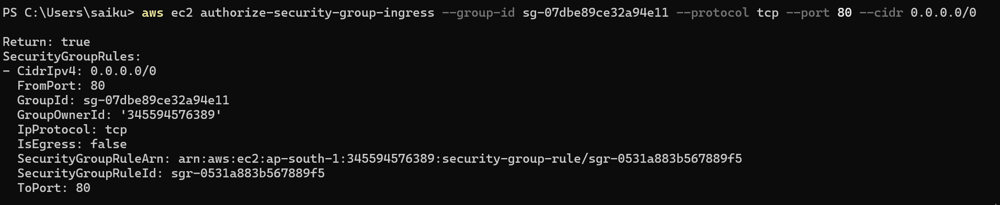

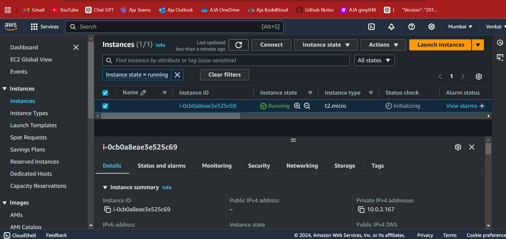

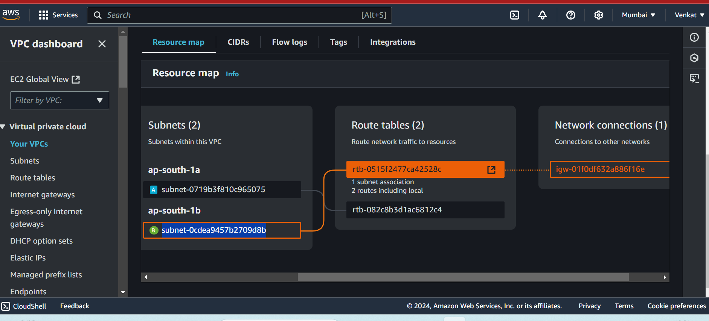

- Create a Ec2 in Pvt Sub 

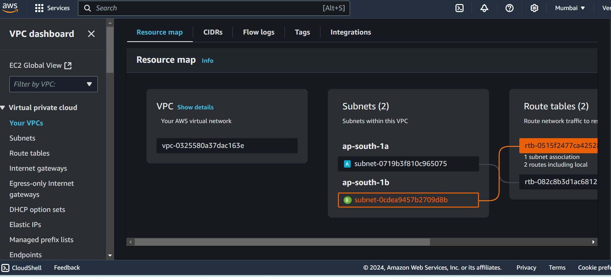