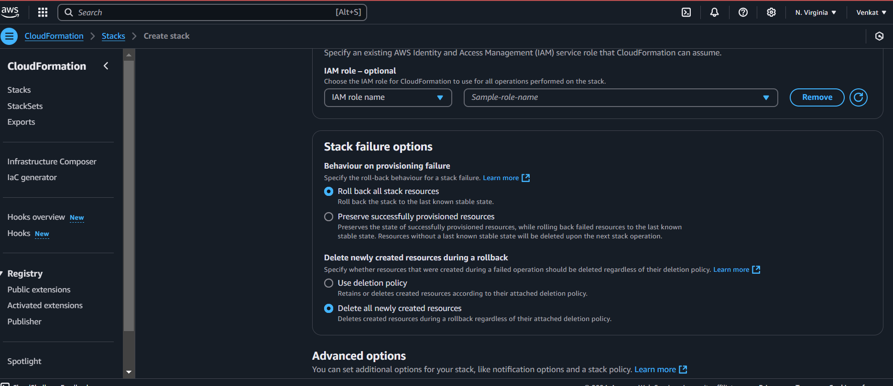

Aws - Cloud Formation Task

Create the below listed resources with AWS - Cloudformation !!!

- Create VPC using CLI

- create Pub and Pvt subnets

- create IGW

- Attach IGW to VPC

- Create Pub and PVT RT
- Attach Pub sub to Pub rt
- Attach Pvt Sub to Pvt rt
- Attach IGW to Pub RT
- Create Sg for ssh // http
- Create a Ec2 in Pub Sub
- Create a Ec2 in Pvt Sub 

